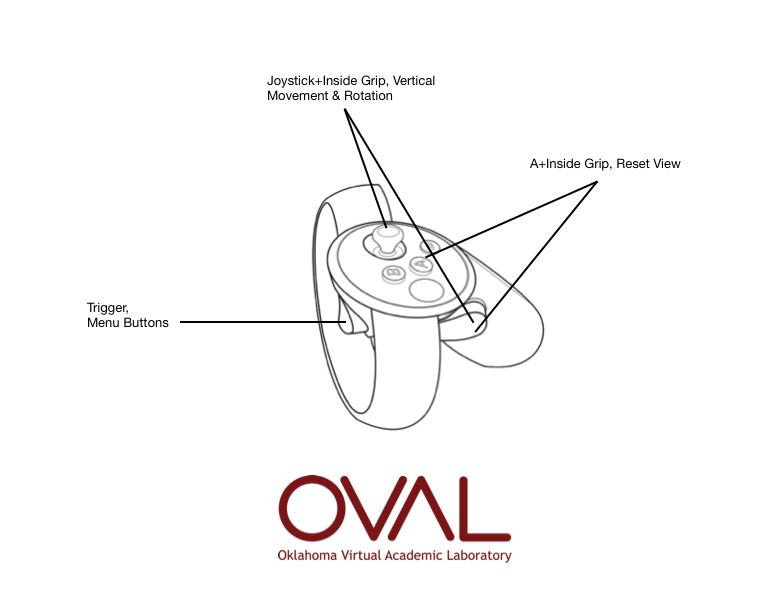
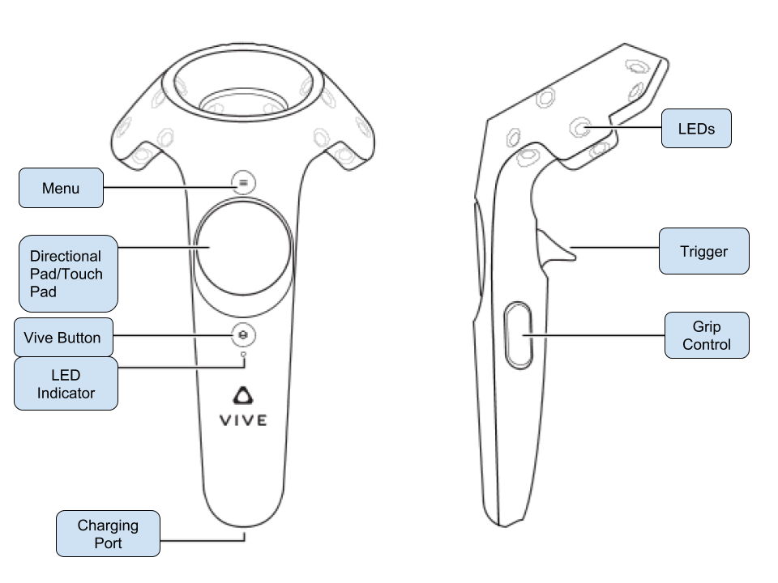

# OVAL (Oklahoma Virtual Academic Labratory)
The Oklahoma Virtual Academic Laboratory (OVAL) is a VR-Classroom application designed to encourage remote collaboration between acdaemics. Up to twenty users can inhabit the same VR space, import 3D content, and analyze 3those models with built-in tools.

## Controls
When controling OVAL, you will use the laser coming off of your controler as a cursor. You will "click" on menu buttons by pointing your controlers laser at the button and clicking with the "trigger" listed in the diagrams below. OVAL is designed to be used with one controller, so the controls are mirrored on the right and left. 

### View Reset

### Vertical Strafing

### Oculus Touch Controls

### HTC Vive Controls

## Menu
Welcome to OVAL! OVAL uses one slim, movable menu to provide you with many functional tools to help analyze or display your 3D content. 

### Moving the Menu
The "Move This" button on the top-left of the moveable menu will allow you to 
### Room Controls

### Movement Select
#### Move Yourself
#### Move Model
#### Move Light

### Mode Select
#### Drag Mode
#### Annotate Mode
#### Indicate Mode
#### Screenshot Mode
#### Measure Mode

### Model Load Screen

