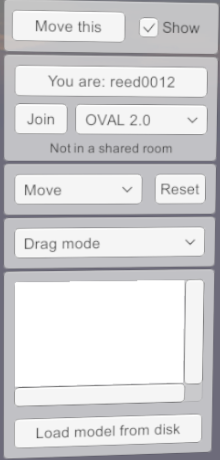

# OVAL (Oklahoma Virtual Academic Labratory)
The Oklahoma Virtual Academic Laboratory (OVAL) is a VR-Classroom application designed to encourage remote collaboration between acdaemics. Up to twenty users can inhabit the same VR space, import 3D content, and analyze 3those models with built-in tools.

## Menu
Welcome to OVAL! OVAL uses one slim, movable menu to provide you with many functional tools. 

### Moving the Menu

### Room Controls

### Movement Select
#### Move Yourself
#### Move Model
#### Move Light

### Mode Select
#### Drag Mode
#### Annotate Mode
#### Indicate Mode
#### Screenshot Mode
#### Measure Mode

### Model Load Screen

## Controls
### Oculus Touch Controls
### HTC Vive Controls
