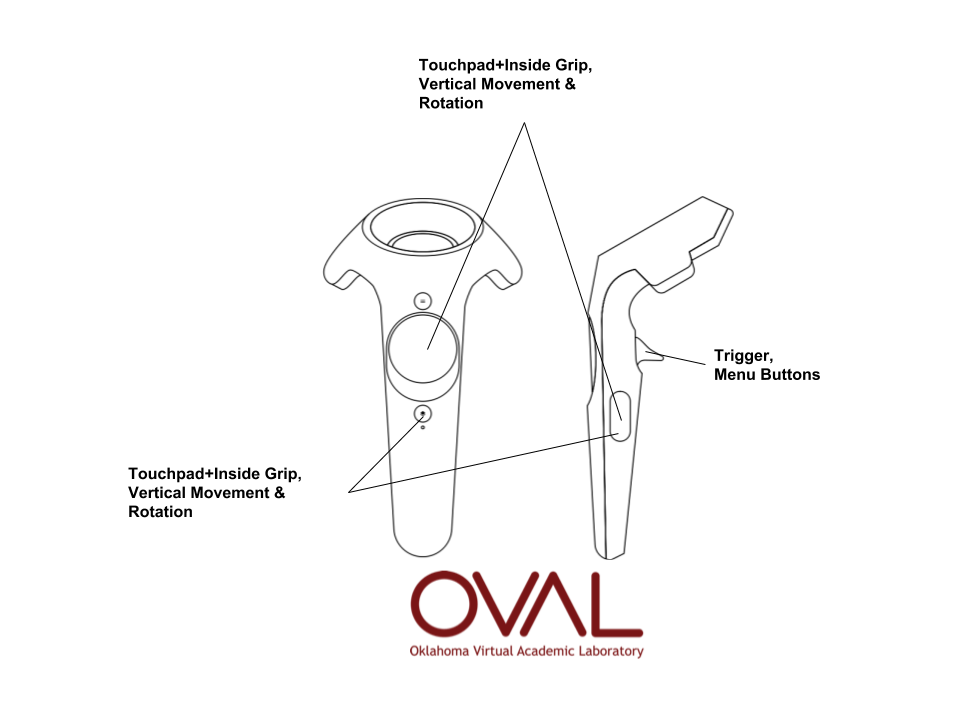

# OVAL (Oklahoma Virtual Academic Labratory)
The Oklahoma Virtual Academic Laboratory (OVAL) is a VR-Classroom application designed to encourage remote collaboration between acdaemics. Up to twenty users can inhabit the same VR space, import 3D content, and analyze 3those models with built-in tools.

## Controls
### Oculus Touch Controls

### HTC Vive Controls

## Menu
Welcome to OVAL! OVAL uses one slim, movable menu to provide you with many functional tools to help analyze or display your 3D content. 

Menu Feature | Notes
------------ | -------------
 | The "Move This" button on the top-left of the menu will allow you to place the menu anywhere you like for your viewing convenience. 
Content in the first column | 
 | asdfa

### Moving the Menu

### Room Controls
OVAL is networked and allows users to meet and view 3D models in an online lab. As long as users have the same "room" defined, they will show up in the same space. One user will have complete controls. Any other user will have limited controls. 

### Movement Select
This drop down allows you to switch between three types of movement.

#### Move Yourself
This allows you to move your avatar within OVAL. This can be seen by others in the room.

#### Move Model
This allows you to move the model. This option is only available to the room owner. 

#### Move Light
This allows you to adjust the lighting of the room. This option is only available to the room owner. 

### Mode Select
This drop down allows you to switch between modes of analyzing your models.

#### Drag Mode
This allows you to use your controls to grab and move your model using the trigger. 

#### Annotate Mode
This mode allows you to annotate on the model. Your laser will paint on the first surface it touches when you pull the trigger. You can select one color or two colors for a gradient for your annotation color. 

#### Indicate Mode
Indicate mode allows you to "ping" the attention of other uses. This gives an audible chime and shows an expansion of the bead at the end of your laser that is visible to all users in the room. 

#### Screenshot Mode
This mode allows you to take pictures within OVAL. This images can be found in your Documents folder.

#### Measure Mode
Measure mode allows you to place to dots on or around your model. OVAL will tell you the straight-line distance between those two points to assist in measuring the model. 

### Model Load Screen
The model load screen will display any models you have added to the model directory. You can also use the button to load files located in other places on your computer. OVAL can be used to view .obj, .stl, .blend, .fbx, and .dae.

#### `ModelPath`
The `ModelPath` line specifies the default directory in which OVAL looks for 3D models (a trailing slash character is optional). This approach ensures that all OVAL clients in a networked session can load the same model files, even where the local file systems differ, provided that the model files are located at the same relative path to `ModelPath`. Where not specified, `ModelPath` defaults to the directory from which the OVAL program was run. Example:
`ModelPath C:\Desktop\Models\`
`ModelPath "C:\Desktop\My new models\subdirectory"`

# OVAL-related Publications
- [Multi-Campus VR Session Tours Remote Cave Art](https://campustechnology.com/articles/2017/10/09/multi-campus-vr-session-tours-remote-cave-art.aspx)
- [Library Journal - University of Oklahoma Expands Networked Virtual Reality Lab](http://lj.libraryjournal.com/2016/08/academic-libraries/university-of-oklahoma-expands-networked-virtual-reality-lab/)
- [Library Journal - Virtual Reality and How to Build an Interdisciplinary Hub](http://lj.libraryjournal.com/2017/09/academic-libraries/carl-grant-virtual-reality-build-interdisciplinary-hub/#_)
- [The Design & Development of an Immersive Learning System for Spatial Analysis and Visual Cognition](http://static1.squarespace.com/static/532b70b6e4b0dca092974dbe/t/5755e2df20c647f04c95598a/1465246433366/pobercook_text+(1).pdf)
- [Virtual Serendipity: Preserving Embodied Browsing Activity in the 21st Century Research Library](http://www.sciencedirect.com/science/article/pii/S0099133317301520)
- [A Hub for Innovation and Learning](https://campustechnology.com/Articles/2018/01/31/A-Hub-for-Innovation-and-Learning.aspx?Page=1)
****************************************************
